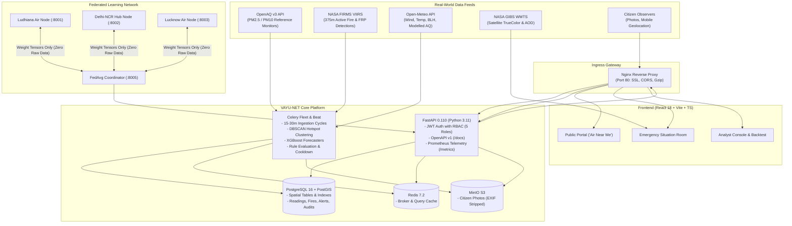

# VAYU-NET (वायु-नेट)
**Production-Grade Federated AI Air Quality & Pollution-Source Intelligence Platform**  
*Indo-Gangetic Economic Corridor (Punjab-Haryana-Delhi-UP)*  
*Track 2: Clean Air & Climate Resilience (BRICS Theme: Sustainability)*  
*Digital Public Good (DPG) Standard Reference Architecture*

---

## 1. Overview & Mission

**VAYU-NET** is an open-source, digital public good designed to provide operational intelligence on macro and hyper-local air pollution events across the Indo-Gangetic economic corridor. 

By fusing ground reference monitors (**OpenAQ v3**), active satellite fire radiometry (**NASA FIRMS VIIRS**), boundary-layer meteorology (**Open-Meteo**), satellite optical depth (**NASA GIBS**), and crowdsourced citizen incident reports, VAYU-NET detects acute pollution hotspots, attributes probable sources with explainable physical kinematics, and computes multi-horizon forecasts (+24h/+48h/+72h).

### Zero Synthetic Data Commitment
- **Real Operational Telemetry**: VAYU-NET does not use synthetic, replay, or fake numbers.
- **Truthful Degradation**: If an external API is down or a sensor is stale, the UI honestly displays `UNAVAILABLE` or `INSUFFICIENT_DATA`.
- **Modelled vs. Measured**: In areas without physical monitors where Open-Meteo atmospheric dispersion is used as a boundary fallback, the data is explicitly tagged `DATA_ORIGIN: MODELLED_ESTIMATE`.

---

## 2. System Architecture



---

## 3. Geographic Corridors (Config-Driven)

Corridors are fully declared in `/backend/config/corridors.yaml`. Adding a new city or economic corridor requires **zero code changes**:

1. **Indo-Gangetic Spine (`indo-gangetic-main`)**:
   - `Ludhiana (30.90, 75.85)` → `Ambala (30.38, 76.78)` → `Delhi Hub (28.61, 77.21)` → `Agra (27.18, 78.02)` → `Kanpur (26.45, 80.35)` → `Lucknow (26.85, 80.95)`
   - **Bounding Box**: Lat [25.5°N, 32.0°N], Lon [73.0°E, 82.0°E] (covers Punjab/Haryana stubble burning and trans-boundary western fires).
2. **Delhi-NCR Industrial Belt (`delhi-ncr-industrial`)**:
   - Narela-Bawana industrial clusters, Gurugram, Faridabad, and Noida.

---

## 4. Role-Based Access Control (RBAC)

| Role | Access Scope & Capabilities |
| :--- | :--- |
| **`public`** | Read-only access to "Air Near Me", 72h forecast, CPCB NAQI advisories, and anonymous citizen report submission. |
| **`authority`** | Situation Room operations console, layer toggles, hotspot inspection, one-click alert acknowledge/resolve, and resource dispatch priority. |
| **`analyst`** | Atmospheric model evaluation, rolling backtest benchmarks vs persistence baseline, and data quality provenance matrix. |
| **`admin`** | User management, RBAC assignment, partner API key provisioning, system audit logs, and data retention rules. |
| **`partner-api-key`**| Programmatic REST ingestion and model federation for partner research institutes and BRICS sister cities. |

---

## 5. Quickstart & Deployment

### Prerequisites
- Docker Engine 24+ & Docker Compose v2+
- Python 3.11+ & Node.js 20+ (for local bare-metal development)

### Step 1: Clone & Configure Environment
```bash
cp .env.example .env
# Edit .env to supply your optional FIRMS_MAP_KEY, OPENAQ_API_KEY, or GEMINI_API_KEY
```

### Step 2: Launch Platform via Docker Compose
```bash
# Development profile (Postgres, Redis, MinIO, Backend, Worker, Frontend, Nginx)
docker compose up -d

# Full profile (includes 3 isolated Federated Learning municipal nodes + coordinator)
docker compose --profile full up -d
```

### Step 3: Seed Default Accounts & Stations
```bash
# Execute within backend container or locally with python:
python scripts/seed_data.py
```

### Seeded Credentials for Testing:
- **Admin**: `admin@vayu-net.org` / `AdminPassword123!`
- **Authority**: `authority@vayu-net.org` / `AuthorityPassword123!`
- **Analyst**: `analyst@vayu-net.org` / `AnalystPassword123!`
- **Partner API Key**: `vayu_partner_test_key_brics_2026`

### Access Points:
- **Frontend Application**: `http://localhost` (or `http://localhost:5173` in Vite dev mode)
- **API Documentation (Swagger)**: `http://localhost/docs` (or `http://localhost:8000/docs`)
- **Prometheus Metrics**: `http://localhost:8000/api/v1/metrics`
- **Health & Readiness**: `http://localhost:8000/api/v1/health` & `/ready`

---

## 6. Digital Public Goods Alliance (DPGA) Compliance

VAYU-NET satisfies all 9 criteria established by the **Digital Public Goods Standard**:

| DPGA Indicator | VAYU-NET Implementation & Compliance Evidence |
| :--- | :--- |
| **1. Relevance to SDGs** | Directly advances **SDG 3.9** (Reduce illness from air pollution), **SDG 11.6** (Reduce adverse urban environmental impact), and **SDG 13** (Climate Action). |
| **2. Open License** | Fully open-source under permissive **Apache 2.0 / MIT** licenses. |
| **3. Clear Ownership** | Developed as a community-driven Digital Public Good for BRICS environmental agencies. |
| **4. Platform Independence** | Operates on commodity hardware, x86/ARM64 edge nodes (Raspberry Pi), bare-metal servers, or any cloud provider with zero vendor lock-in. |
| **5. Comprehensive Documentation** | Complete documentation suite in `/docs`: [Architecture](docs/ARCHITECTURE.md), [Data Schema](docs/DATA_SCHEMA.md), [Model Card](docs/MODEL_CARD.md), [Runbook](docs/RUNBOOK.md), [Security](docs/SECURITY.md), and [Deployment](docs/DEPLOYMENT.md). |
| **6. Non-Proprietary Data Extraction** | Unrestricted open data egress via OASIS CAP 1.2 XML, public Atom 1.0 RSS syndication, JSON REST APIs, and Prometheus telemetry. |
| **7. Privacy by Design** | Strict privacy protections: zero PII collected, EXIF metadata stripped from citizen photos, coordinates fuzzed to a ~500m spatial grid ($0.005^\circ$), and $(\varepsilon=2.0, \delta=10^{-5})$ Local Differential Privacy on model updates. |
| **8. Adherence to Open Standards** | Compliant with **OASIS CAP 1.2**, **W3C Atom 1.0**, **OpenAPI 3.1**, **CPCB NAQI**, **Brazil CONAMA 491**, and **China MEP HJ 633**. |
| **9. Do No Harm by Design** | Strict data integrity guards: zero mock/synthetic data, explicit `DATA_ORIGIN` tags (`MEASURED` vs `MODELLED`), and honest `INSUFFICIENT_DATA` alerts when observations are thin (<48 hours). |

---

## 7. BRICS Cross-Corridor Adoption

To deploy VAYU-NET in an international airshed without code modifications:

1. **Export localized DPG bundle**:
   ```bash
   python scripts/brics_export.py --country Brazil --corridor sao-paulo-campinas --out dist/dpg_brazil
   ```
2. **Deploy the localized edge profile**:
   ```bash
   cd dist/dpg_brazil
   docker compose -f docker-compose.edge.yml up -d
   ```
3. **Verify localized deployment**:
   ```bash
   python scripts/verify_deployment.py --base-url http://localhost:8000
   ```

---

## 8. Honest Operational Disclosures & Limitations

1. **Source Attribution**: Calculations are heuristic evaluations derived from physical wind vectors, upwind angular discrepancy (\(\Delta\theta\)), and distance-decay fire radiative power (FRP). They are operational indicators and do not constitute legal causation.
2. **Federated Learning Demonstration**: Municipal nodes (Ludhiana, Delhi, Lucknow, São Paulo, Beijing) deploy as isolated services. They adhere strictly to the sovereign federated contract: **only PyTorch weight tensors travel between nodes and the coordinator; raw telemetry never leaves the node**.
3. **Smog Transport Timelines**: Travel-time projections assume steady-state wind vectors and dry particulate deposition rates and are explicitly labeled **Approximate Travel Time** in all UI presentations.
4. **Government Integration**: VAYU-NET is an independent Digital Public Good reference platform built to open disaster management standards (OASIS CAP 1.2, CPCB NAQI). It makes no claim of certified sovereign government integration.

