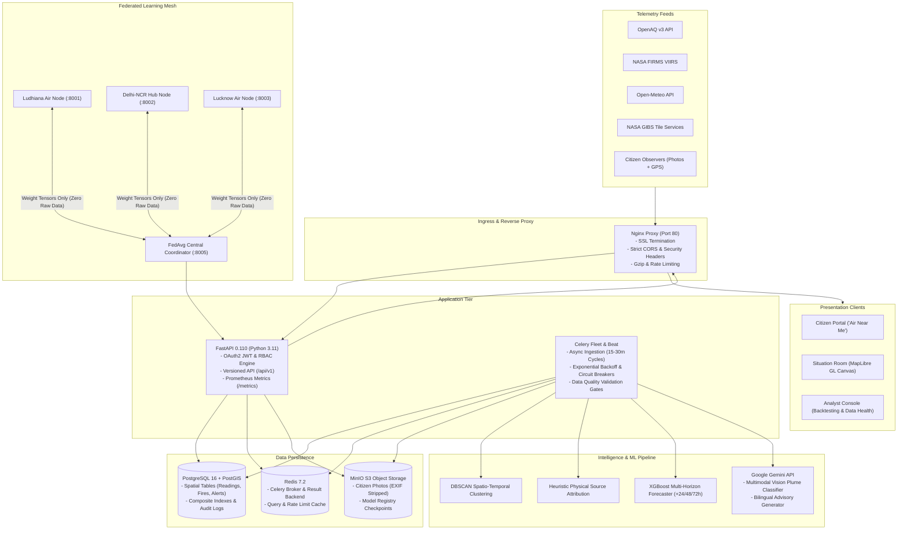

# VAYU-NET System Architecture Document
**Version 1.0 (Digital Public Good Standard)**  
*Federated, AI-Powered Air Quality and Pollution-Source Intelligence Platform*

---

## 1. System Topology Overview

VAYU-NET is an enterprise, multi-tenant digital public good built to address trans-boundary air pollution across multi-jurisdictional economic corridors. The platform decouples ingestion, spatial analytics, predictive modeling, federated learning, and operator presentation into hardened, modular subsystems.

---

## 2. Key Architectural Decisions (ADRs)

### ADR-001: Zero Synthetic Data Policy
- **Context**: Climate intelligence platforms often rely on fabricated replay numbers to look impressive.
- **Decision**: VAYU-NET strictly prohibits synthetic mock generation. If an external API is down or data is thin, the system truthfully returns `UNAVAILABLE` or `INSUFFICIENT_DATA`. Modelled data is explicitly tagged `MODELLED`.

### ADR-002: Configuration-Driven Corridors
- **Context**: Hardcoding corridor geometry prevents adoption across other BRICS nations.
- **Decision**: All corridor definitions, coordinates, and bounding boxes reside in `/backend/config/corridors.yaml`. Adding a new corridor requires zero code changes.

### ADR-003: Federated Learning vs Raw Centralization
- **Context**: Municipalities and sovereign nations cannot share raw citizen reports or unreleased micro-sensor telemetry due to data protection laws.
- **Decision**: Implement PyTorch Federated Averaging (FedAvg). Local nodes train models on private databases; only weight gradient tensors are exchanged with the coordinator.

### ADR-004: Multimodal AI with Physical Verification
- **Context**: Crowdsourced citizen photos can suffer from spam or misclassification.
- **Decision**: Citizen photos are classified via Google Gemini Vision, and cross-referenced with NASA FIRMS active fire pixels. Only cross-validated reports receive the `Verified by Satellite/Sensor` badge.

### ADR-005: OASIS CAP 1.2 Alert Interoperability
- **Context**: Air quality alerts must trigger official disaster response mechanisms without custom integrations.
- **Decision**: Implement the OASIS Common Alerting Protocol (CAP) v1.2 XML/JSON standard for downstream consumption by National and State Disaster Management Authorities (NDMA/SDMA).

---

## 3. Mathematical & Algorithmic Formulations

### 3.1 Atmospheric Kinematic Source Attribution
The platform attributes observed particulate spikes to upwind emission sources using a mass-conserving kinematic atmospheric dispersion formulation.

1. **Haversine Geodesic Distance ($d$)**:
   $$\Delta\phi = \phi_2 - \phi_1, \quad \Delta\lambda = \lambda_2 - \lambda_1$$
   $$a = \sin^2\left(\frac{\Delta\phi}{2}\right) + \cos\phi_1 \cos\phi_2 \sin^2\left(\frac{\Delta\lambda}{2}\right)$$
   $$d = 2 R \cdot \operatorname{atan2}\left(\sqrt{a}, \sqrt{1-a}\right), \quad R = 6371.0 \text{ km}$$

2. **Forward Azimuth Bearing ($\theta_{fire}$)**:
   $$\theta_{fire} = \operatorname{atan2}\left(\sin\Delta\lambda \cos\phi_2, \; \cos\phi_1\sin\phi_2 - \sin\phi_1\cos\phi_2\cos\Delta\lambda\right) \pmod{360^\circ}$$

3. **Upwind Angular Alignment ($A$)**:
   The downwind advection vector from the fire towards the station is compared with the local wind direction $\theta_{wind}$:
   $$\Delta\theta = |(\theta_{wind} - \theta_{fire} + 180^\circ) \bmod 360^\circ - 180^\circ|$$
   $$A = \max\left(0, \; \cos\left(\frac{\pi \cdot \Delta\theta}{180^\circ}\right)\right)$$

4. **Distance Exponential Decay ($D$)**:
   Plume dilution and dry deposition over downwind transport:
   $$D = \exp\left(-\frac{d}{d_0}\right), \quad d_0 = 75.0 \text{ km}$$

5. **Planetary Boundary Layer Trapping Factor ($T$)**:
   Shallow nocturnal and winter inversion layers compress pollutants into the surface breathing zone:
   $$T = \max\left(1.0, \; \frac{1500.0}{\max(BLH, 100.0)}\right)$$

6. **Composite Source Contribution Score ($S$)**:
   $$S = A \cdot D \cdot \left(\frac{FRP}{100.0}\right) \cdot T$$
   A source is classified as **Dominant Upwind Agricultural Burning** when $S \ge 0.40$ and $\Delta\theta \le 45^\circ$.

---

### 3.2 Differential Privacy & Federated Averaging (FedAvg)

To guarantee that raw telemetry and citizen reports cannot be reconstructed through gradient inversion attacks, each municipal client enforces Local $(\varepsilon, \delta)$-Differential Privacy prior to parameter transmission:

1. **$L_2$ Gradient Norm Clipping**:
   $$\mathbf{g}_{clipped} = \frac{\mathbf{g}}{\max\left(1, \; \frac{\|\mathbf{g}\|_2}{C}\right)}, \quad C = 1.5$$

2. **Calibrated Gaussian Noise Mechanism**:
   $$\sigma = \frac{\sqrt{2\ln(1.25 / \delta)} \cdot C}{\varepsilon}, \quad \varepsilon = 2.0, \; \delta = 10^{-5}$$
   $$\tilde{\mathbf{g}} = \mathbf{g}_{clipped} + \mathcal{N}(0, \sigma^2 \mathbf{I})$$

3. **Sample-Weighted Parameter Aggregation (FedAvg)**:
   The central coordinator combines node model tensors weighted by validated observation count $n_k$:
   $$\mathbf{w}_{global}^{(t+1)} = \sum_{k=1}^K \frac{n_k}{N} \mathbf{w}_k^{(t)}, \quad N = \sum_{k=1}^K n_k$$

4. **Weight Divergence & Byzantine Anomaly Gate**:
   A candidate round is rejected if the weight delta exceeds the corridor stability threshold:
   $$\Delta_{div} = \|\mathbf{w}_{global}^{(t+1)} - \mathbf{w}_{global}^{(t)}\|_2 > 5.0$$

---

## 4. Digital Public Good: Cross-Corridor Portability
VAYU-NET achieves zero-code international adoption across BRICS nations by decoupling geography and regulatory scales into declarative metadata:

- **Corridor Geometries**: Managed in `backend/config/corridors.yaml` defining bounding boxes, station coordinates, and regional hub assignments for India, Brazil, China, and South Africa.
- **Regulatory AQI Breakpoints**: Managed in `backend/config/aqi_breakpoints.yaml` allowing zero-code switching between India CPCB NAQI, Brazil CONAMA Resolution 491, China MEP HJ 633, and US EPA standards.
- **Edge Deployment Footprint**: `docker-compose.edge.yml` enables localized air quality analysis on low-cost single-board computers or edge servers without centralized cloud dependencies.

